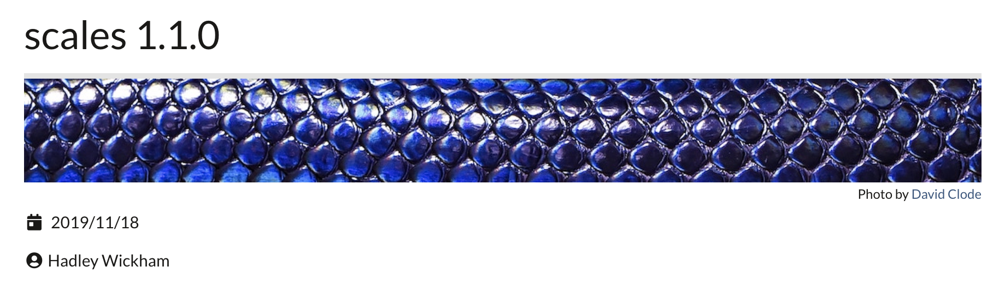

class: middle, center


## What do we mean by "scales" really?? <br/> What is scaling? `r emo::ji("chart_with_upwards_trend")`

 (1) converting data values to perceptual properties 

`r emo::ji("plus")`

 (2) the inverse process: making guides (legends and axes) to read the graph 

<br/>
<br/>

Scaling and guides are often some of the most difficult parts of building any visualization.

---
class: center, middle


The scales package provides the internal scaling infrastructure to
[ggplot2](github.com/tidyverse/ggplot2) and exports standalone, **system-agnostic**,
functions. 

**You can use scales to customize the transformations, breaks, guides and palettes in your visualizations.**

---
class: center, middle

```{r setup, include=FALSE}
library(scales)
library(ggplot2)
library(xaringanthemer)
mono_light(
  base_color = "#1c5253",
  header_font_google = google_font("Josefin Sans"),
  text_font_google   = google_font("Montserrat", "300", "300i"),
  code_font_google   = google_font("Droid Mono"), 
  link_color = "#DF5286"
)
options(htmltools.dir.version = FALSE)
knitr::opts_chunk$set(echo = TRUE, dpi = 180, fig.height = 4)
```



## `r emo::ji("warning")` Notable changes!

+ New naming convention for guides functions: `breaks_*`, `labels_*` 
  + allows for nice tab completion!
+ New `demo_*` functions for easy ggplot exampling

---
class: center, middle

## A plot in need of some improvement
```{r, fig.height = 4}
ggplot(txhousing, aes(x = volume, y = median)) + geom_point(na.rm = T)
```

---
class: center, middle
# Guides: Breaks & Labels

# Making Guides easy: scales' formatters
The scales package also provides useful helper 
functions for formatting numeric data for all types of labels 
As of 1.0.0, most of scales formatters are just variations on the generic `number()`
and `number_format()` functions. 


---
class: center, middle

# The number formatter
+ The generic formatter offers consistency in behaviour and arguments across formatters
and adds additional functionality for international customization.
+ With it's adoption, existing formatters gained new, consistent arguments for 
`scale`, `accuracy`, `trim`, `big.mark`, `decimal.mark`, `prefix`, `suffix` etc. 

---
class: center, middle, inverse


# The number formatter, in action
By default, `number()` will take any numeric vector, round them to nearest whole
number, add spaces between every 3 digits and return a character vector useful for
feeding to a labels argument in ggplot2. 
```{r}
label_number(c(12.3, 4, 12345.789, 0.0002))
```

---
class: center, middle, inverse


# Changing defaults
You can easily specify a different rounding behavior, or change the `big_mark` 
or `decimal_mark` for international 
styling. Even add a `prefix` or a `suffix` or `scale` your numbers on the fly. 
```{r}
label_number(c(12.3, 4, 12345.789, 0.0002),
  big.mark = ".",
  decimal.mark = ",",
  accuracy = .01
)
```


---
class: left, middle

# Other Formatters:

- `label_date` `label_time()` : Formatted dates and times.
- `label_ordinal()`: add ordinal suffixes (-st, -nd, -rd, -th) to numbers according to languages (english, spanish, french).
- `label_pvalue` : p-values formatter
- `label_scientific` : Scientific formatter
- `label_number_auto` : Auto formatting in number and scientific
- `label_bytes` `label_number_si` 
- `label_parse` `label_math`

---

`label_wrap`: handy wrapping! 

```{r, fig.height = 2.5}
x <- c(
  "this is a long label",
  "this is another long label",
  "this a label this is even longer"
)

demo_discrete(x, labels = label_wrap(10))
```

---
class: left, middle

## label_* Examples 
```{r, formatters}
# label_percent takes a numeric and does your division and labelling for you
label_percent()(x = c(0.1, 1 / 3, 0.56))

# each label_* function can be customized
# percent formatting in the French style
french_percent <- label_percent(decimal.mark = ",", suffix = " %")
french_percent(runif(10))

# label_comma() adds commas into large numbers for easier readability
label_comma()(10e6)

# label_dollar() adds currency symbols
label_dollar()(c(100, 125, 3000))

# currency formatting Euros (and simple conversion!)
usd_to_euro <- label_dollar(prefix = "", suffix = "\u20ac", scale = .86)
usd_to_euro(100)
```

---
class: center, middle

## Applied in ggplot scales
```{r}
dsamp <- dplyr::sample_n(diamonds, 1000)
ggplot(dsamp, aes(x = carat, y = price, colour = clarity)) +
  geom_point() + scale_y_continuous(labels = usd_to_euro)
```

---
class: center, middle, inverse

## Breaks

- `scales::breaks_extended()` sets most breaks by default in ggplot2
- `breaks_pretty()` is an alternative break calculation 
- `breaks_log()` is used to set breaks for log transformed axes with `log_trans()`.
- `breaks_width()` is used to set breaks by width, including for date and date/time axes.

---
class: center, middle
# Transformations

scales provides a number of common transformation functions (`*_trans()`) which 
specify functions to preform data transformations, format labels, and set correct breaks.

For example:
`log_trans()`, `sqrt_trans()`, `reverse_trans()` power the `scale_*_log10()`,
`scale_*_sqrt()`, `scale_*_reverse()` functions in ggplot2. 

---
class: center, middle

## Additional Transformations
- `asn_trans()` : Arc-sin square root transformation.
- `atanh_trans()` : Arc-tangent transformation.
- `boxcox_trans()` `modulus_trans()` : Box-Cox & modulus transformations.
- `date_trans()` `time_trans()` `hms_trans()` : transformations for date, datetime, and hms classes
- `exp_trans()` : Exponential transformation (inverse of log transformation).
- `pseudolog_trans()` : Pseudo-log transformation
- `probabilty_trans()`: Probability transformation
and more... 

---
class: middle, left

## Building your own transformations

scales also gives users the ability to define and apply their own custom 
transformation functions for repeated use.
```{r transforms}
# use trans_new to build a new transformation
si_log <- trans_new(
  name = "si_log",
  trans = log_trans(base = 10)$trans, # extract a single element from another trans
  inverse = function(x) 10^(x), # or write your own custom functions
  breaks = breaks_log(),
  format = label_number_si()
  )
```

---
class: middle, left

## Applied in ggplot2
```{r}
# apply our new transformation!
ggplot(txhousing, aes(x = volume, y = median)) +
  geom_point(na.rm = T) + scale_x_continuous(trans = si_log)
```

---
# Palettes

---
class: center, middle
# Colour palettes `r emo::ji("art")`
scales provides a number of color pallete functions that, given a range of values 
or the number of colours your want, will return a range of colors by hex code. 
```{r, palettes}
# pull a list of colours from any palette
viridis_pal()(4)
brewer_pal(type = "div", direction = -1)(4)
div_gradient_pal()(seq(0, 1, length.out = 4))
```

---

class: center, middle
# Using scales outside of ggplot2
```{r, fig.width = 2 }
# show_col is a quick way to view palette output
show_col(viridis_pal()(4))
```

# Use scales palettes with baseR
These functions are primarily used under the hood in ggplot2, but can be combined 
with any plotting system. For example, use them in combination with `grDevices::palette()`,
provided with base R, to affect your base plots...

---
class: center, middle
# BaseR example
```{r, fig.height = 3}
palette(viridis_pal()(4))
plot(Sepal.Length ~ Sepal.Width, data = iris, col = Species, pch = 20)
```

---
class: center, middle
## Non-color palettes
Often you want to be able to scale elements other than color. e.g. size, alpha, shape... 
Of course, scales handles those too!
```{r}
your_data <- runif(13, 1, 20)
area_pal(range = c(1, 20))(your_data)
shape_pal()(6)
```

---
class: center, middle

# See these in action in ggplot2
```{r, eval=FALSE}
# color examples...
scale_fill_brewer()
scale_color_grey()
scale_color_viridis_c()
# shape examples
scale_shape()
scale_shape_ordinal()
# implement them yourself with...
scale_color_manual()
scale_shape_manual()
scale_size_manual()
# using available scales functions!
```

---
class: center, middle

# One last things: Bounds 
## Rescaling data
scales provides a handful of functions for rescaling data to fit new ranges.
```{r rescale}
# the rescale functions can rescale continuous vectors to new min, mid, or max values
x <- runif(5, 0, 1)
x
rescale(x, to = c(0, 50))
rescale_mid(x, mid = .25)
rescale_max(x, to = c(0, 50))
```

---
class: center, middle, inverse

## Squish, Discard, Censor
```{r squish}
# squish() will squish your values into a specified range, respecting NAs
squish(c(-1, 0.5, 1, 2, NA), range = c(0, 1))
# discard will drop data outside a range, respecting NAs
scales::discard(c(-1, 0.5, 1, 2, NA), range = c(0, 1))
# censor will return NAs for values outside a range
censor(c(-1, 0.5, 1, 2, NA), range = c(0, 1))
```

---
class: center, middle, inverse

## Applied to ggplot2
<font size= "4">Squish can be really useful for setting the `oob` argument for a colour scale with reduced limits.</font>
```{r}
ggplot(iris, aes(x = Sepal.Length, y = Sepal.Width, colour = Sepal.Length)) +
  geom_point() + scale_color_continuous(limit = c(6, 8), oob = scales::squish)
```

---
class: center, middle, inverse

## Questions?

Slides: [danaseidel.com/rstudioconf2020](https://danaseidel.com/rstudioconf2020)

Code: [github.com/dpseidel/rstudioconf2020](https://github.com/dpseidel/rstudioconf2020)

@dpseidel on [Twitter](https://twitter.com/dpseidel) and [GitHub](https://github.com/dpseidel)